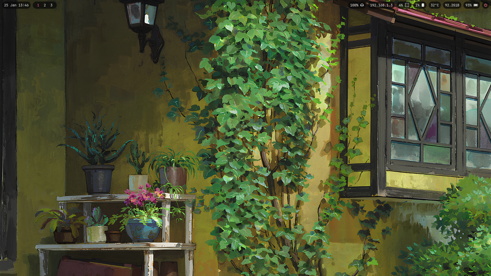
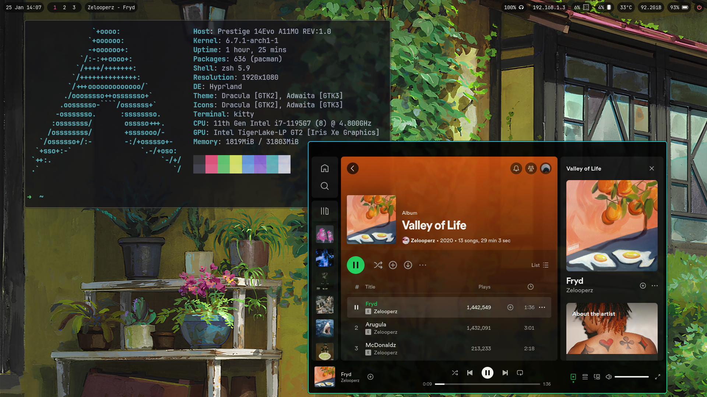
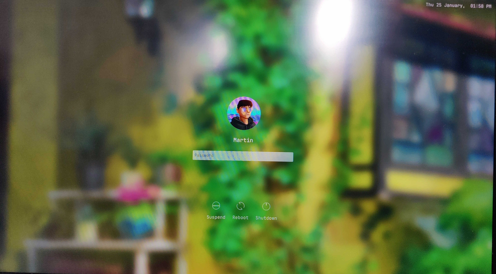

# Dotfiles

## Dependancies

| App            | Package  |
| -------------- | -------- |
| Shell          | zsh      |
| Window Manager | hyprland |
| Status Bar     | waybar   |
| Terminal       | kitty    |
| Editor         | vs code  |

archinstall with hyprland desktop profile

## Install Packages

```bash
yay -Syu zsh \
    waybar-hyprland \
    swaylock-effects \
    wlogout \
    mako \
    hyprpaper \
    ttf-jetbrains-mono-nerd \
    nwg-look \
    dracula-gtk-theme \
    dracula-icons-git \
    chilli-sddm-theme \
    pavucontrol \
    grim \
    slurp \
    google-chrome \
    spotify-launcher \
    python-gobject \
    visual-studio-code-bin \
```

## Get config files

```bash
git clone --depth 1 --separate-git-dir=$HOME/.dotfiles https://github.com/martinbartolo/dotfiles.git $HOME/dotfiles-tmp
    rm -r ~/dotfiles-tmp/
    alias config='/usr/bin/git --git-dir=$HOME/.dotfiles/ --work-tree=$HOME'
```

## SDDM configuration

### Changing theme

```bash
sudo vim /usr/lib/sddm/sddm.conf.d/default.conf
```

In the [Theme] section set Current=chili.

To change the font set Font=JetbrainsMono Nerd Font

### Changing wallpaper

```bash
sudo mv .wallpapers/garden.png /usr/share/sddm/themes/assets/garden.png
```

```bash
sudo vim /usr/share/sddm/themes/chilli/theme.conf
```

Set background=assets/garden.png

### Changing Avatar

Name an image \<username\>.face.icon

```bash
sudo mv <your image> /usr/share/sddm/faces/<username>.face.icon
```

## Screenshots




